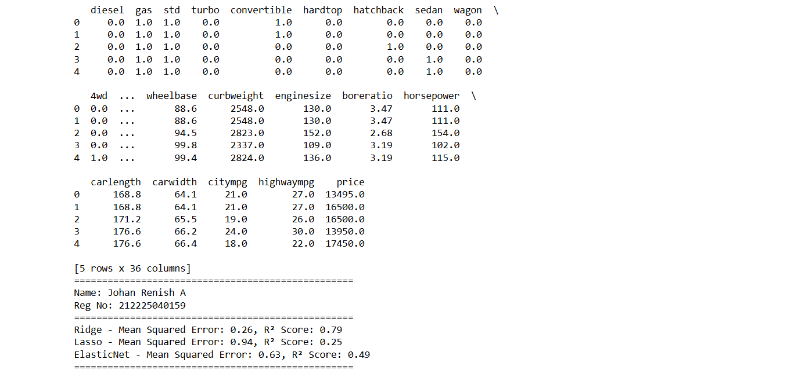
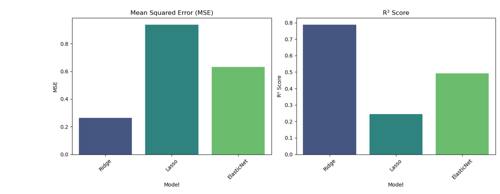

# BLENDED_LEARNING
# Implementation of Ridge, Lasso, and ElasticNet Regularization for Predicting Car Price

## AIM:
To implement Ridge, Lasso, and ElasticNet regularization models using polynomial features and pipelines to predict car price.

## Equipments Required:
1. Hardware – PCs
2. Anaconda – Python 3.7 Installation / Jupyter notebook

## Algorithm
1.Import the required libraries such as pandas, numpy, matplotlib, seaborn and sklearn modules.

2.Load the dataset encoded_car_data.csv using the read_csv() function.

3.Perform data preprocessing by converting categorical variables into numerical values using get_dummies().

4.Separate the dataset into feature variables (X) and target variable (y) where the target is car price.

5.Apply StandardScaler to normalize the feature values and target variable.

6.Split the dataset into training and testing sets using train_test_split() with an 80:20 ratio.

7.Define the regularization models: Ridge, Lasso, and ElasticNet.

8.Create a pipeline that includes PolynomialFeatures and the regression model.

9.Train the model using the fit() method on the training dataset.

10.Predict the car prices using the predict() method on the test dataset.

11.Evaluate the model performance using Mean Squared Error (MSE) and R² Score.

12.Store the results and visualize them using bar plots with seaborn.

13.Display the comparison results for Ridge, Lasso, and ElasticNet models.
## Program:
```
/*
Program to implement Ridge, Lasso, and ElasticNet regularization using pipelines.
Developed by:Johan Renish A
RegisterNumber:212225040159
*/
import pandas as pd
import numpy as np
import matplotlib.pyplot as plt
import seaborn as sns
from sklearn.model_selection import train_test_split
from sklearn.preprocessing import PolynomialFeatures, StandardScaler
from sklearn.linear_model import Ridge, Lasso, ElasticNet
from sklearn.pipeline import Pipeline
from sklearn.metrics import mean_squared_error, r2_score

# Load the dataset
data = pd.read_csv("encoded_car_data (1).csv")
print(data.head())

# Data preprocessing
#data = data.drop(['CarName', 'car_ID'], axis=1)
data = pd.get_dummies(data, drop_first=True)

# Splitting the data into features and target variable
X = data.drop('price', axis=1)
y = data['price']

# Standardizing the features
scaler = StandardScaler()
X = scaler.fit_transform(X)
y = scaler.fit_transform(y.values.reshape(-1, 1)).flatten()

# Splitting the dataset into training and testing sets
X_train, X_test, y_train, y_test = train_test_split(X, y, test_size=0.2, random_state=42)

# Define the models
models = {
    "Ridge": Ridge(alpha=1.0),
    "Lasso": Lasso(alpha=1.0),
    "ElasticNet": ElasticNet(alpha=1.0, l1_ratio=0.5)
}
# Dictionary to store results
results = {}

# Train and evaluate each model
for name, model in models.items():
    # Create a pipeline with polynomial features and the model
    pipeline = Pipeline([
        ('poly', PolynomialFeatures(degree=2)),
        ('regressor', model)
    ])

    # Fit the model
    pipeline.fit(X_train, y_train)

    # Make predictions
    predictions = pipeline.predict(X_test)

    # Calculate performance metrics
    mse = mean_squared_error(y_test, predictions)
    r2 = r2_score(y_test, predictions)

    # Store results
    results[name] = {'MSE': mse, 'R2 Score': r2}

# Print results
print('=' * 50)
print("Name: Johan Renish A")
print("Reg No: 212225040159")
print('=' * 50)
for model_name, metrics in results.items():
    print(f"{model_name} - Mean Squared Error: {metrics['MSE']:.2f}, R² Score: {metrics['R2 Score']:.2f}")
print('=' * 50)
# Convert results to DataFrame for easier plotting
results_df = pd.DataFrame(results).T.reset_index()
results_df.rename(columns={'index': 'Model'}, inplace=True)

# Set the figure size and create subplots
plt.figure(figsize=(12, 5))

# Bar plot for MSE
plt.subplot(1, 2, 1)
sns.barplot(x="Model", y="MSE", data=results_df, palette="viridis")
plt.title("Mean Squared Error (MSE)")
plt.ylabel("MSE")
plt.xticks(rotation=45)

# Bar plot for R2 Score
plt.subplot(1, 2, 2)
sns.barplot(x="Model", y="R2 Score", data=results_df, palette="viridis")
plt.title("R² Score")
plt.ylabel("R² Score")
plt.xticks(rotation=45)

# Show the plots
plt.tight_layout()
plt.show()
```
## Output:
 

## Result:
Thus, Ridge, Lasso, and ElasticNet regularization models were implemented successfully to predict the car price and the model's performance was evaluated using R² score and Mean Squared Error.
